# Analiza pomiaru 1
## Rozmieszczenie nadajników

## Pozycje pomiarowe

## Boxploty RSSI dla poszczególnych nadajników

## Mapa z siłą sygnału (RSSI)
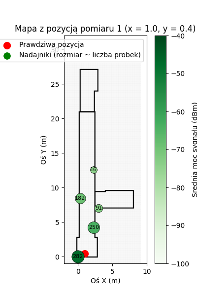
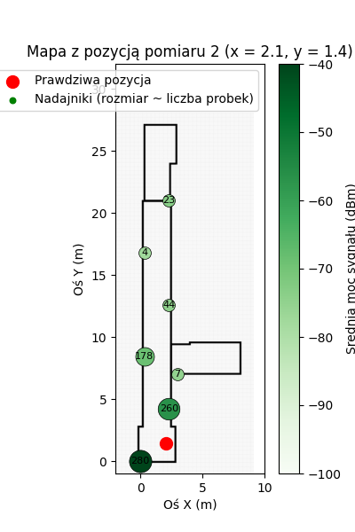
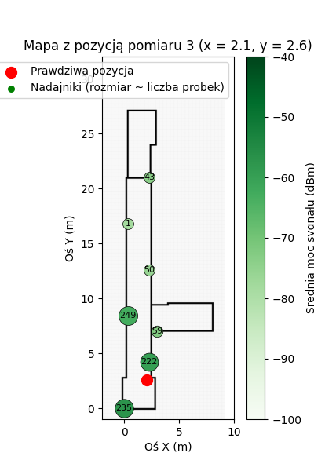

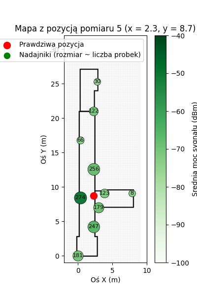

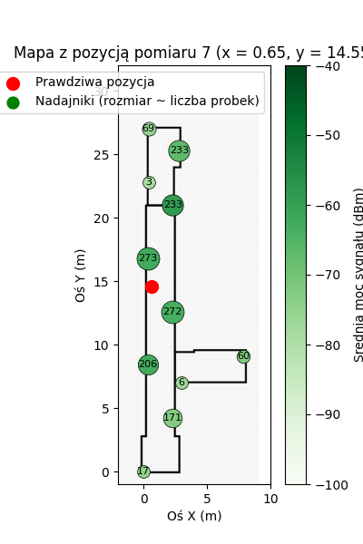
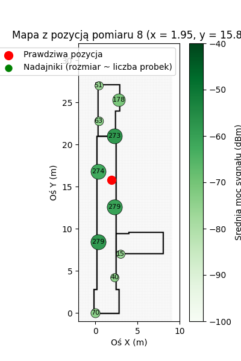
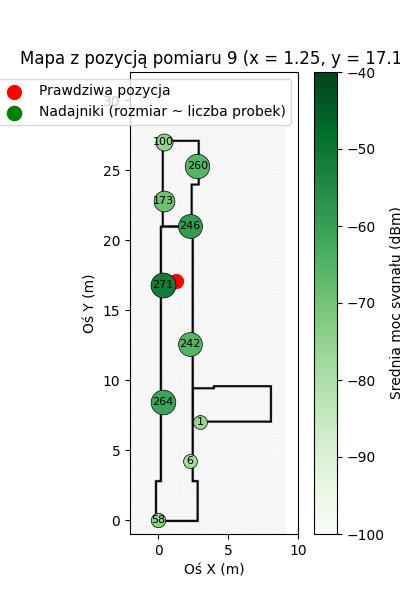
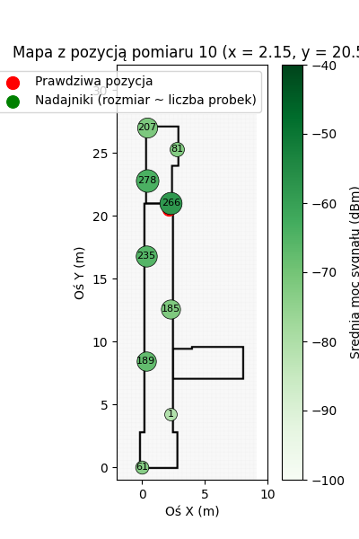
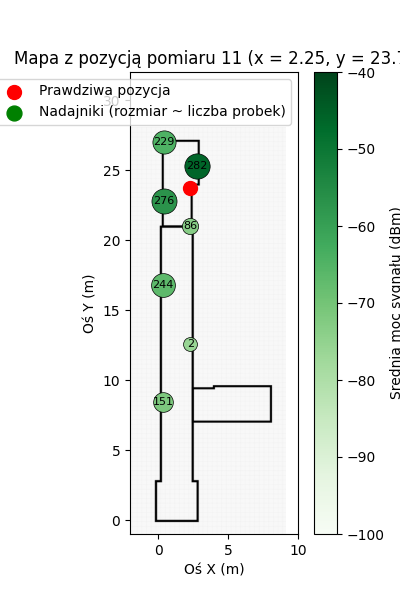

## Odległość od nadajników
Dzięki mocy sygnału (RSSI) można oszacować odległość od nadajnika. Potrzebne jednak jest poznanie zależności między mocą sygnału a odległością.
W tym celu użyjemy wcześniej przeprowadzonych pomiarów mocy sygnału w różnych znanych pozycjach.
Dzięki temu możemy wyznaczyć zależność między mocą sygnału a odległością.
### Regresja Liniowa
Zależność między mocą sygnalu (RSSI) a odległością od nadajnika, wyznaczymy przy pomocy regresji liniowej na podstawie zebranych danych pomiarowych.
Poniższy wykres przedstawia wyniki regresji liniowej, gdzie oś X odpowiada logarytmowi odległości od nadajnika, a oś Y reprezentuje moc sygnału (RSSI w dBm).

Ten sam wykres ale z osią X w skali liniowej.
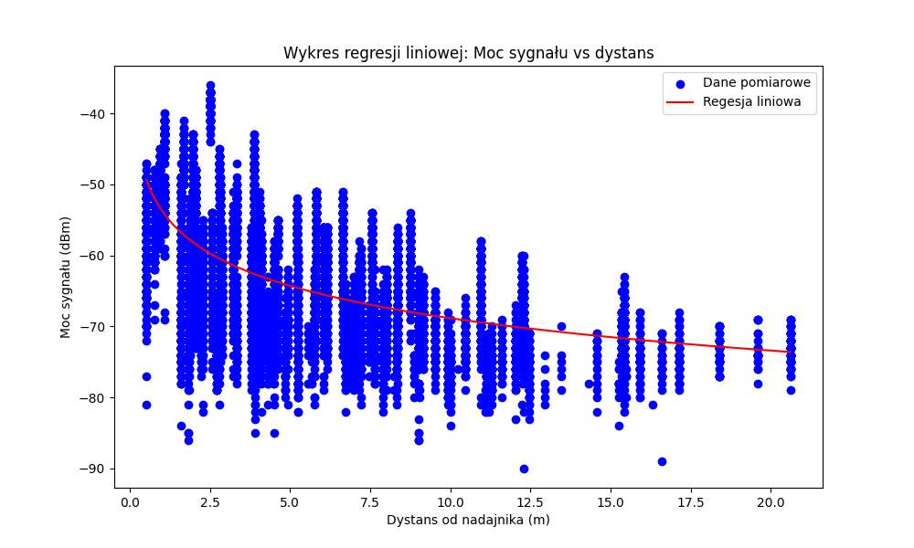

## Algorytm minimalizacji metodą najmniejszych kwadratów
Do aproksymacji pozycji, użyty zostanie algorytm najmniejszych kwadratów

### Monte Carlo + Least Squares

Korzystając z pomiarów, dla każdego z nadajników w każdej pozycji pomiarowej, wyliczona została średnia moc sygnału.
Następnie wokół tej wartości nawygenerowano z rozkładu normalnego, populację nowych mocy sygnałów.

Kolejno przy użyciu zależności wyznaczonej wczesniej z regresji liniowej,wyliczono odległość między  odpowiada tej mocy dla tego nadajnika. Wartości tych odległości następnie użyto w algorytmie najmniejszych kwadratów w celu estymacji pozycji urządzenia pomiarowego. Poniżej przedstawiono wyniki estymacji pozycji dla każdej z 11 pozycji pomiarowych.

Algorytm wykorzystuje funkcję `calculate_residuals`, która oblicza różnicę pomiędzy:
- **rzeczywistymi odległościami** od punktu estymowanego `(x, y)` do beaconów,
a **wyliczonymi odległościami z rssi** (`distances`).

#### Wzór na odległość
Odległość od punktu `(x, y)` do beacona o współrzędnych `(x_i, y_i)` wyrażona jest wzorem euklidesowym:

\[
d_i = \sqrt{(x - x_i)^2 + (y - y_i)^2}
\]

#### Różnica
Różnica pomiędzy obliczoną odległością z wyznaczonego punktu, a tą zmierzoną z mocy:

\[
r_i = d_i - d(s_i)
\]

#### Funkcja celu
Metoda najmniejszych kwadratów minimalizuje sumę kwadratów residuów:

\[
F(x, y) = \sum_{i=1}^{N} \left( \sqrt{(x - x_i)^2 + (y - y_i)^2} - d(s_i) \right)^2
\]

gdzie:
- \( (x, y) \) – szukana pozycja,
- \( (x_i, y_i) \) – współrzędne beaconów,
- \( d_i^{measured} \) – zmierzona odległość do beacona.

#### Własna wersja

\[
F(x, y) = \sum_{i=1}^{N} \frac{| d_i - d(s_i) |}{d(s_i)}
\]
Zamiana kwadratu residuów bierzemy ich wartość absolutną.Zwiększa to rozdzielczość.

Podzielenie przez odległość sprawia, że residua dużych odległości są uważane za mniej istotne, dlatego są mniej redukowane, a algorytm zbliża się bardziej do nadajników z mocniejszą mocą sygnału.

#### Działanie algorytmu
1. **Start** od początkowego przybliżenia `initial_guess`.
2. **Obliczenie residuów** dla wszystkich beaconów.
3. **Minimalizacja** sumy kwadratów residuów przy użyciu `least_squares`.
4. **Wynik** – najlepsze przybliżenie pozycji `(x, y)`, które najbardziej pasuje do zmierzonych odległości.

# Algorytm least squares

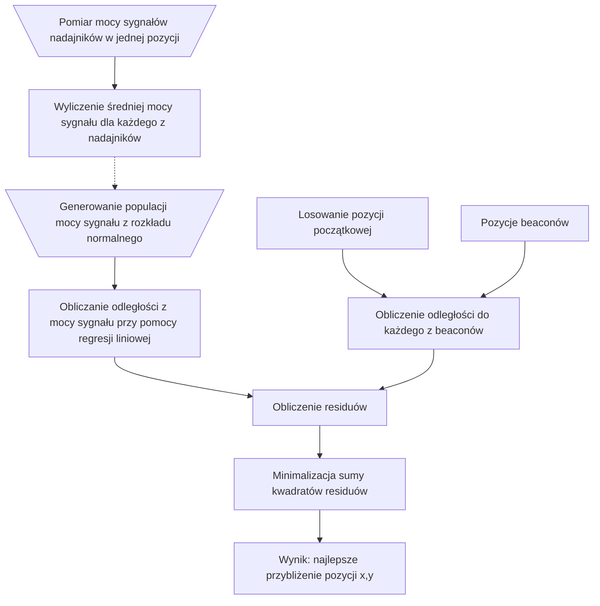

## Metoda monte carlo do wyznaczenia odległości

W celu oszacowania odległości od nadajników na podstawie zmierzonych wartości mocy sygnału (RSSI), zastosowano metodę Monte Carlo. Dla każdej z 11 pozycji pomiarowych, wygenerowano 1000 próbek mocy sygnału z rozkładu normalnego, wykorzystując średnią i odchylenie standardowe zmierzonych wartości RSSI. Następnie, korzystając z wcześniej wyznaczonej regresji liniowej, przeliczono każdą z wygenerowanych próbek mocy sygnału na odpowiadającą jej odległość od nadajnika.

