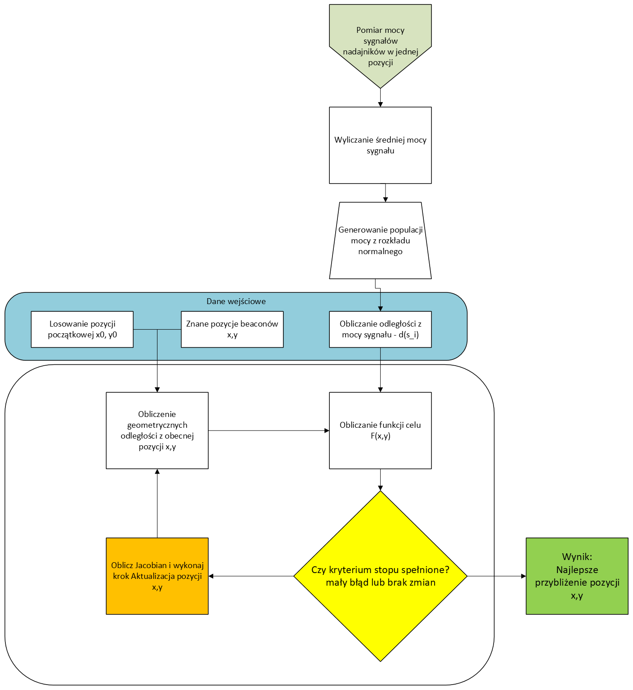

# Analiza pomiaru 1
## Rozmieszczenie nadajników

## Pozycje pomiarowe

## Boxploty RSSI dla poszczególnych nadajników

## Mapa z siłą sygnału (RSSI)

## Odległość od nadajników geometryczna
Odległość od punktu `(x, y)` do nadajnika o współrzędnych `(x_i, y_i)` wyrażona jest wzorem euklidesowym:

\[
d_i = \sqrt{(x - x_i)^2 + (y - y_i)^2}
\]

## Odległości od nadajników z mocy sygnału (RSSI)
Dzięki mocy sygnału (RSSI) można oszacować odległość od nadajnika. Potrzebne jednak jest poznanie zależności między mocą sygnału a odległością.

W tym celu użyjemy wcześniej przeprowadzonych pomiarów mocy sygnału w różnych znanych pozycjach.
### Regresja Liniowa
Zależność między mocą sygnalu (RSSI) a odległością od nadajnika, wyznaczymy przy pomocy regresji liniowej na podstawie zebranych danych pomiarowych.
Poniższy wykres przedstawia wyniki regresji liniowej, gdzie oś X odpowiada logarytmowi odległości od nadajnika, a oś Y reprezentuje moc sygnału (RSSI w dBm).

Ten sam wykres ale z osią X w skali liniowej.

Obliczoną z regresji liniowej odległość będziemy oznaczać jako: \[d(s_i)\] 
gdzie:
- $s_i$ to moc sygnału z nadajnika i(RSSI).

## Algorytm optymalizacji (Funkcja celu)

Do aproksymacji pozycji  wykorzystano iteracyjny algorytm minimalizacji błędów. Jego zadaniem jest znalezienie takich współrzędnych , dla których odległości geometryczne  są jak najbardziej zbliżone do odległości wyznaczonych z pomiarów .

### Residuum

Jako miarę błędu lokalnego (residuum) dla pojedynczego nadajnika przyjmuje się różnicę bezwzględną pomiędzy obiema odległościami:

$$r_i = | d_i - d(s_i) |$$

### Zmodyfikowana funkcja kosztu

Zamiast klasycznej metody najmniejszych kwadratów (sumy kwadratów błędów), zastosowano zmodyfikowaną funkcję celu. Residuum z klasycznego wzoru zostało dodatkowo podzielone przez moc sygnału. Pozwala to na promowanie mniejszych błędów przy większych mocach sygnału (czyli mniejszych odległościach od nadajnika), co jest korzystne z punktu widzenia dokładności lokalizacji.:

$$F(x, y) = \sum_{i=1}^{N} \frac{| d_i - d(s_i) |}{d(s_i)}$$

gdzie:
- $N$ - liczba nadajników

## Monte Carlo

Korzystając z pomiarów, dla każdego z nadajników, w każdej pozycji pomiarowej, wyliczona została średnia moc sygnału.

Następnie wokół tej wartości wygenerowano, z rozkładu normalnego, populację nowych mocy.

Kolejno przy użyciu zależności wyznaczonej wczesniej z regresji liniowej, wyliczono odległość odpowiadającą danej mocy. Wartości tych odległości następnie użyto w algorytmie najmniejszych kwadratów w celu estymacji pozycji urządzenia pomiarowego. 

### Algorytm least squares

W celu oszacowania odległości od nadajników na podstawie zmierzonych wartości mocy sygnału (RSSI), zastosowano metodę Monte Carlo. Dla każdej z 11 pozycji pomiarowych, wygenerowano 1000 próbek mocy sygnału z rozkładu normalnego, wykorzystując średnią i odchylenie standardowe zmierzonych wartości RSSI. Następnie, korzystając z wcześniej wyznaczonej regresji liniowej, przeliczono każdą z wygenerowanych próbek mocy sygnału na odpowiadającą jej odległość od nadajnika.

Poniżej przedstawiono wyniki estymacji pozycji dla każdej z 11 pozycji pomiarowych.

