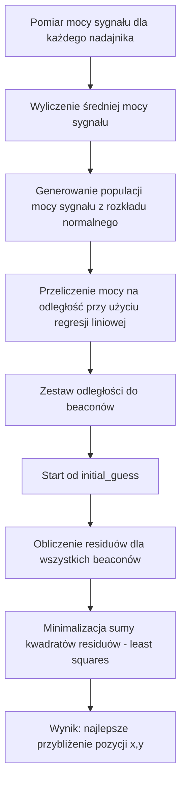

# Analiza pomiaru 1
## Rozmieszczenie nadajników

## Pozycje pomiarowe

## Boxploty RSSI dla poszczególnych nadajników

## Mapa z siłą sygnału (RSSI)

## Regresja Liniowa

## Rozrzut wygenowanych próbek odległości

## Least Squares - Estymacja pozycji
Z pomiarów, dla każdego z nadajników w każdej pozycji pomiarowej, wyliczono średnią moc sygnału. Wokół tej wartości wygenerowano z rozkładu normalnego, populację nowych mocy sygnału. Następnie przy użyciu znanego wzoru z regresji liniowej wyliczono jaka odległość odpowiada tej mocy dla tego nadajnika. Wartości tych odległości następnie użyto w algorytmie najmniejszych kwadratów w celu estymacji pozycji urządzenia pomiarowego. Poniżej przedstawiono wyniki estymacji pozycji dla każdej z 11 pozycji pomiarowych.

### Algorytm minimalizacji metodą najmniejszych kwadratów

Algorytm wykorzystuje funkcję `calculate_residuals`, która oblicza różnicę pomiędzy:
- **rzeczywistymi odległościami** od punktu estymowanego `(x, y)` do beaconów,
- a **wyliczonymi odległościami z rssi** (`distances`).

#### Wzór na odległość
Odległość od punktu `(x, y)` do beacona o współrzędnych `(x_i, y_i)` wyrażona jest wzorem euklidesowym:

\[
d_i^{true} = \sqrt{(x - x_i)^2 + (y - y_i)^2}
\]

#### Residuła (różnica)
Residuła dla każdego beacona to różnica pomiędzy obliczoną odległością a zmierzoną:

\[
r_i = d_i^{true} - d_i^{measured}
\]

#### Funkcja celu
Metoda najmniejszych kwadratów minimalizuje sumę kwadratów residuów:

\[
F(x, y) = \sum_{i=1}^{N} \left( \sqrt{(x - x_i)^2 + (y - y_i)^2} - d_i^{measured} \right)^2
\]

gdzie:
- \( (x, y) \) – szukana pozycja,
- \( (x_i, y_i) \) – współrzędne beaconów,
- \( d_i^{measured} \) – zmierzona odległość do beacona.

#### Działanie algorytmu
1. **Start** od początkowego przybliżenia `initial_guess`.
2. **Obliczenie residuów** dla wszystkich beaconów.
3. **Minimalizacja** sumy kwadratów residuów przy użyciu `least_squares`.
4. **Wynik** – najlepsze przybliżenie pozycji `(x, y)`, które najbardziej pasuje do zmierzonych odległości.

# Algorytm estymacji pozycji urządzenia

