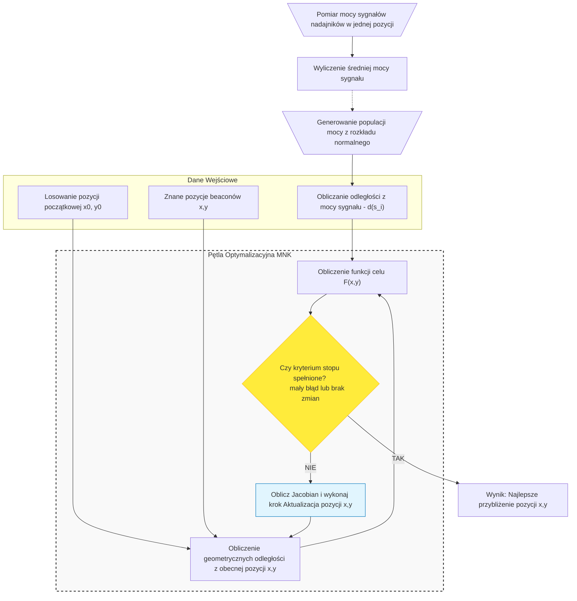

```mermaid

flowchart TD
    %% Sekcja przetwarzania sygnału (bez zmian)
    A[\Pomiar mocy sygnałów nadajników w jednej pozycji/] --> B[Wyliczenie średniej mocy sygnału]
    B -.-> C[\Generowanie populacji mocy z rozkładu normalnego/]
    C --> H["Obliczanie odległości z mocy sygnału - d(s_i) "]

    %% Dane wejściowe do algorytmu
    
    subgraph Dane_Wejsciowe [Dane Wejściowe]
        direction LR
        E[Znane pozycje beaconów x,y]
        F[Losowanie pozycji początkowej x0, y0]
        H
    end

    %% Algorytm iteracyjny Least Squares
    subgraph Iteracyjny_Algorytm_Least_Squares [Pętla Optymalizacyjna MNK]
        direction LR
        H --> J_iter["Obliczenie funkcji celu F(x,y)"]
        F --> G_iter[Obliczenie geometrycznych odległości z obecnej pozycji x,y ]
        E--> G_iter
        G_iter --> J_iter
        
        J_iter --> K_check{Czy kryterium stopu spełnione? 
        mały błąd lub brak zmian}
        
        K_check -- NIE --> L_update[Oblicz Jacobian i wykonaj krok Aktualizacja pozycji x,y]
        
        direction BT
        L_update --> G_iter 
        
    end
    direction LR
    M[Wynik: Najlepsze przybliżenie pozycji x,y]
    %% Wynik
    K_check -- TAK --> M

    %% Stylowanie dla czytelności
    style Iteracyjny_Algorytm_Least_Squares fill:#f9f9f9,stroke:#333,stroke-width:2px,stroke-dasharray: 5 5
    style K_check fill:#ffeb3b,stroke:#fbc02d
    style L_update fill:#e1f5fe,stroke:#0277bd
```
