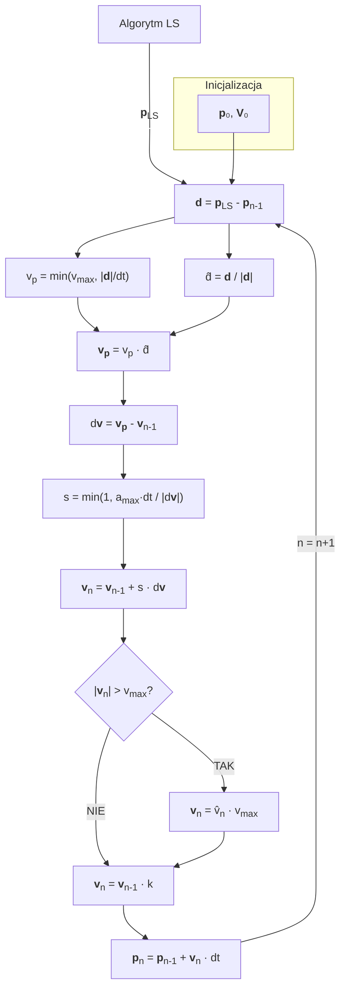

```mermaid
graph TD
    subgraph Inicjalizacja
    A[<b>p</b>₀, <b>V</b>₀]
    end

    LS[Algorytm LS] --- LS_LABEL(["<b>p</b><sub>LS</sub>"]) --> B
    A --> B["<b>d</b> = <b>p</b><sub>LS</sub> - <b>p</b><sub>n-1</sub>"]
    B --> C["d̂ = <b>d</b> / |<b>d</b>|"]

    B --> D["v<sub>p</sub> = min(v<sub>max</sub>, |<b>d</b>|/dt)"]
    D --> E["<b>v<sub>p</sub></b> = v<sub>p</sub> · d̂"]
    C --> E
    E --> F["d<b>v</b> = <b>v<sub>p</sub></b> - <b>v</b><sub>n-1</sub>"]

    F --> G["s = min(1, a<sub>max</sub>·dt / |d<b>v</b>|)"]
    
    G --> H["<b>v</b><sub>n</sub> = <b>v</b><sub>n-1</sub> + s · d<b>v</b>"]
    
    H --> I{"|<b>v</b><sub>n</sub>| > v<sub>max</sub>?"}
    
    I -- TAK --> J["<b>v</b><sub>n</sub> = v̂<sub>n</sub> · v<sub>max</sub>"]
    I -- NIE --> K["<b>v</b><sub>n</sub> = <b>v</b><sub>n-1</sub> · k"]
    J --> K
    K --> L["<b>p</b><sub>n</sub> = <b>p</b><sub>n-1</sub> + <b>v</b><sub>n</sub> · dt"]

    
    L -->|n = n+1| B

    style LS_LABEL fill:none,stroke:none
```