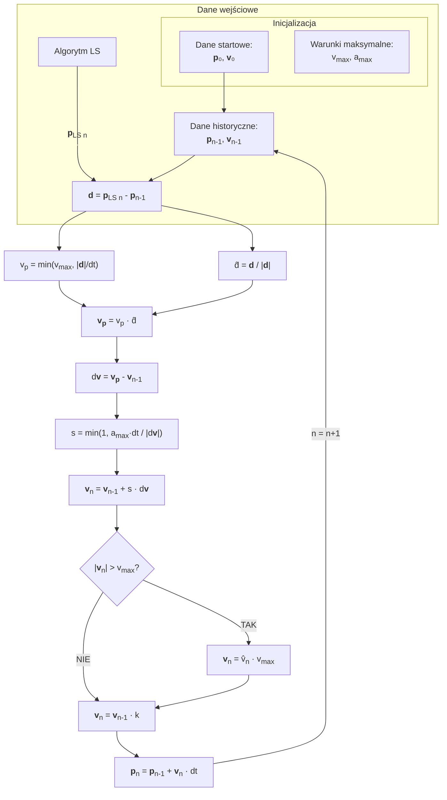

## Legenda:

- LS - algorytm najmniejszych kwadratów, który estymuje pozycję na podstawie pomiarów.
- d̂ - jednostkowy wektor kierunku ruchu, obliczany na podstawie różnicy między estymowaną pozycją a poprzednią pozycją.
- v̂n - jednostkowy wektor prędkości, obliczany na podstawie prędkości maksymalnej i prędkości estymowanej.