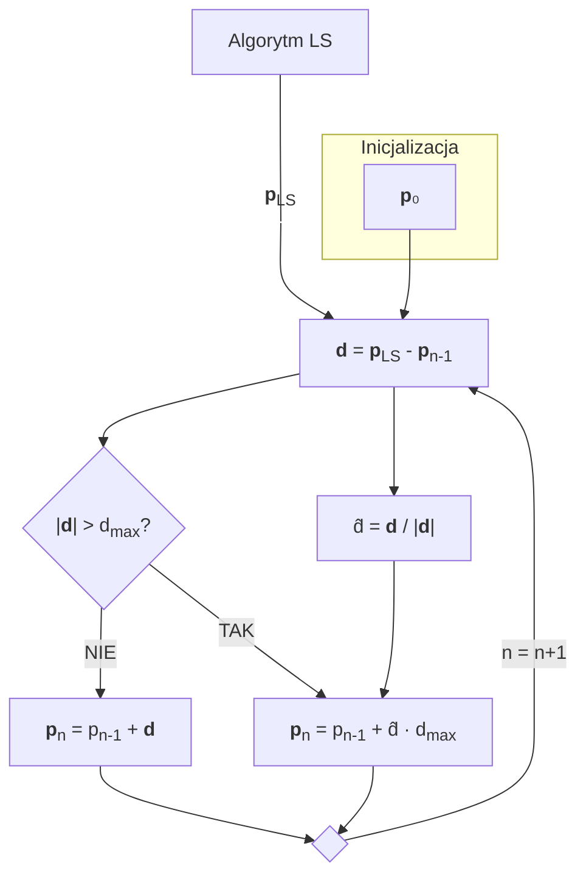

```tikz
\begin{tikzpicture}[
    node distance=2cm and 2.5cm,
    every node/.style={draw, rectangle, align=center},
    decision/.style={diamond, aspect=2, draw},
    start/.style={draw=none},
    connector/.style={circle, fill, inner sep=1.5pt}
]

% Nodes
\node[start] (A) {$\mathbf{p}_0$};

\node (LS) [left=of A] {Algorytm LS};
\node[start] (LS_LABEL) [below=of LS] {$\mathbf{p}_{LS}$};

\node (B) [below=of A] {$\mathbf{d} = \mathbf{p}_{LS} - \mathbf{p}_{n-1}$};

\node[decision] (I) [below=of B] {$\| \mathbf{d} \| > d_{\max}$?};

\node (H) [right=of B] {$\hat{\mathbf{d}} = \frac{\mathbf{d}}{\| \mathbf{d} \|}$};

\node (G) [below left=of I] {$\mathbf{p}_n = \mathbf{p}_{n-1} + \mathbf{d}$};

\node (J) [below right=of I] {$\mathbf{p}_n = \mathbf{p}_{n-1} + \hat{\mathbf{d}} \, d_{\max}$};

\node[connector] (K) [below=of I] {};

% Connections
\draw[->] (A) -- (B);

\draw[->] (LS) -- (LS_LABEL);
\draw[->] (LS_LABEL) -- (B);

\draw[->] (B) -- (I);
\draw[->] (B) -- (H);

\draw[->] (I) -- node[left] {NIE} (G);
\draw[->] (I) -- node[right] {TAK} (J);

\draw[->] (H) -- (J);

\draw[->] (G) -- (K);
\draw[->] (J) -- (K);

\draw[->] (K) |- node[right] {$n = n + 1$} (B);

\end{tikzpicture}
```
