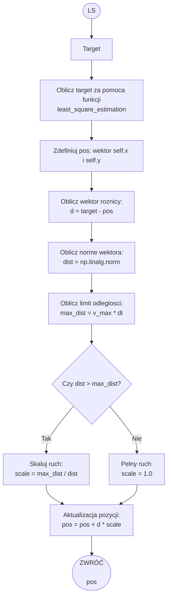

```mermaid
graph TD
    A([LS])-->B[Target]
    B --> C[Oblicz target za pomoca funkcji<br/>least_square_estimation]
    C --> D[Zdefiniuj pos: wektor self.x i self.y]
    D --> E[Oblicz wektor roznicy:<br/>d = target - pos]
    E --> F[Oblicz norme wektora:<br/>dist = np.linalg.norm]
    F --> G[Oblicz limit odleglosci:<br/>max_dist = v_max * dt]
    G --> H{Czy dist > max_dist?}
    H -- Tak --> I[Skaluj ruch: <br/>scale = max_dist / dist]
    H -- Nie --> J[Pelny ruch: <br/>scale = 1.0]
    I --> K[Aktualizacja pozycji: <br/>pos = pos + d * scale]
    J --> K
    K --> M([ZWRÓĆ \n<br/> pos])
```
